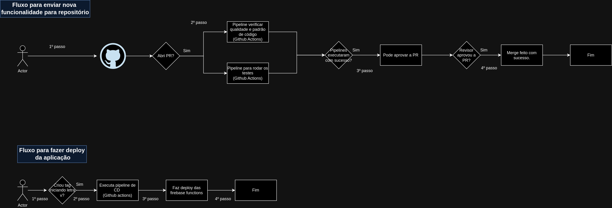

## TECNOLOGIAS

- Node.js(v18.17.1)
- Npm(v9.6.7)
- Javascript
- Firebase function
- Firebase firestore(Banco de dados)
- Github actions(CI/CD pipeline e verificar qualidade e padrão de código)

## INSTRUÇÕES DO PROJETO

- Clonar repositório
- Acessar o diretório **src**
- Executar o comando **npm install** para instalar dependências do projeto
- Instalar firebase-cli. Link que usei: https://firebaseopensource.com/projects/firebase/firebase-tools/
- Executar o comando **firebase login** para conectar firebase cli com usa conta do Firebase.
- Precisar acessar o painel do Firebase para criar o _default_ Firestore database.
- Criar o arquivo **src/credential.json**. OBS: para gerar arquivo acesse o seu projeto, clique em _Project settings_, clicar em _Service accounts_ e clicar no botão _Generate new private key_
- Executar o comando **cd src && npm run deploy**

## INSTRUÇÕES PARA RODAR TESTES DO PROJETO

- Clonar repositório
- Acessar o diretório **src**
- Executar o comando **npm install** para instalar dependências do projeto
- Instalar firebase-cli. Link que usei: https://firebaseopensource.com/projects/firebase/firebase-tools/
- Executar o comando **firebase login** para conectar firebase cli com usa conta do Firebase.
- Precisar acessar o painel do Firebase para criar o _default_ Firestore database.
- Criar o arquivo **src/credential-test.json**. OBS: para gerar arquivo acesse o seu projeto, clique em _Project settings_, clicar em _Service accounts_ e clicar no botão _Generate new private key_
- Executar o comando **cd src && npm run test**.

## ARQUITETURA

### Explicando passos:

- 1º passo: usuário faz requisição para URL.
- 2º passo: primeiro a requisição passo pelo **Cloudflare WAF** onde tem regras de rate limit para evitar ataques DDOS e controlar quantas requisições o usuário pode fazer para a Firebase functions. Se requisição passar pelo WAF a requisição é envia para a Firebase function para criar o registro.
  - OBS:
    - Cloudflare WAF é interessante para aplicar rate limit antes de executar o código, pois evita fazer chamada para o Firebase functions e também evita ser cobrado por essa chamada.
    - Firebase functions está usando functions v2 onde 1 functions pode receber mais de 1 requisição, assim reduzimos o cold start (tempo para iniciar a Firebase function). Link falando sobre: https://firebase.google.com/docs/functions/version-comparison
- 3º passo: o registro e salvo no Firebase firestore.
- 4º: Se foi criando um registro, então a Firebase function irá ser disparado para definir o campo increment_id do registro criado.

## FLUXO PR

### Explicando passos:

- 1º passo: dev envia o código para repositório do Github.
- 2º passo: se abriu a PR para o branch develop, stage ou master será executado o Github actions para verificar a qualidade do código e rodar os testes(unitários e integração).
- 3º passo: Se todas as pipelines executando com sucesso poderá aprovar PR.
- 4º passo: Se revisor aprovou a PR e fez merge, o código irá ser enviado para o branch: develop, stage, master.

## FLUXO DEPLOY

### Explicando passos:

- 1º passo: dev responsável criar uma tag iniciando com a letra v. Exemplo: v1.0.0
- 2º passo: Dispara a Github actions pipeline para fazer o deploy das Firebase functions automáticamente.
- 3º passo: Faz o deploy das Firebase functions.
- 4º passo: Se o passo anterior foi um successo, é fim.
